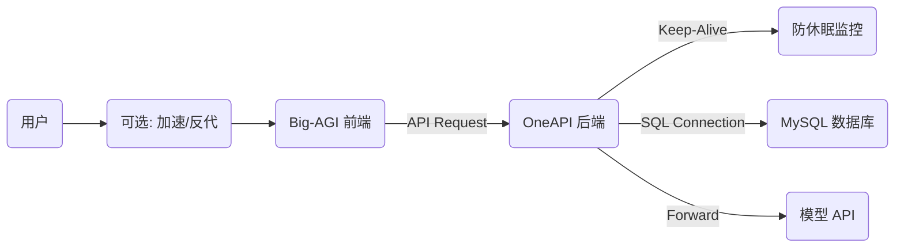

# 🚀 零成本全栈 AI 代理网站搭建指南

本文档记录了基于 **Big-AGI (前端)** + **OneAPI (后端策略)** + **TiDB (数据库)** + **Render (容器托管)** 的完全免费搭建方案。支持多模型分栏对比 (Side-by-side)、API 分流策略及持久化配置。

## 🏗️ 架构概览



---

## 🛠️ 第一阶段：准备数据库 (TiDB Cloud)
**目的**：为 OneAPI 提供持久化存储，防止 Render 重启导致账号数据丢失。

1.  注册 [TiDB Cloud](https://tidbcloud.com/)。
2.  创建一个免费的 **Serverless Tier** 集群。
3.  点击 **Connect** 获取连接信息（Host, Port, User, Password）。
4.  **关键：构造 `SQL_DSN` 连接字符串**
    *   **格式要求**：必须包含 `tcp(...)` 和 `tls` 参数。
    *   **模板**：
        ```text
        用户名:密码@tcp(主机地址:4000)/数据库名?tls=true
        ```
    *   *示例*：
        `2Re23.root:Abc123456@tcp(gateway01.us-west-2.prod.aws.tidbcloud.com:4000)/test?tls=true`

---

## ⚙️ 第二阶段：部署后端 (OneAPI on Render)
**目的**：统一管理 API Key，设置负载均衡和路由策略。

1.  注册 [Render](https://dashboard.render.com/)。
2.  **New Web Service** -> **Deploy from image**。
3.  **Image URL**: `justsong/one-api:latest`
4.  **Instance Type**: Free (512MB RAM).
5.  **Environment Variables (环境变量)**：
    | Key | Value | 说明 |
    | :--- | :--- | :--- |
    | `SQL_TYPE` | `mysql` | 数据库类型 |
    | `SQL_DSN` | `(见第一阶段生成的字符串)` | **核心配置**，格式错会导致启动失败 |
    | `TZ` | `Asia/Shanghai` | 时区设置 |
    | `PORT` | `3000` | 默认端口 |

6.  **部署验证**：
    *   检查 Logs 是否显示 `One API started`。
    *   访问域名 `https://xxx.onrender.com`，默认账号 `root` / `123456`。
    *   **登录后请立即修改密码并在 Channels 添加你的模型 Key。**

---

## 💓 第三阶段：配置保活 (UptimeRobot)
**目的**：防止 Render 免费实例在 15 分钟无流量后自动休眠。

1.  注册 [UptimeRobot](https://uptimerobot.com/)。
2.  **Add New Monitor**：
    *   **Type**: `HTTP(s)`
    *   **URL**: `https://你的render域名.onrender.com` (直接填主页，**不要**填 `/api/status` 以免 404)
    *   **Interval**: `5 minutes` (必须小于 15 分钟)
3.  **备选方案 (如果必须监控 API 接口)**：
    *   **Type**: `Keyword` (强制 GET 请求)
    *   **URL**: `.../api/status`
    *   **Keyword**: `true`

---

## 💻 第四阶段：部署前端 (Big-AGI on Vercel)
**目的**：提供类似 OpenWebUI 的界面，支持多模型分栏 (Beam Mode)。

1.  访问 [Big-AGI GitHub](https://github.com/enricoros/big-AGI)，点击 **Deploy to Vercel**。
2.  **配置环境变量 (实现免登录配置)**：
    在 Vercel 的 Settings -> Environment Variables 中添加：

    | Variable Name | Value | 说明 |
    | :--- | :--- | :--- |
    | `OPENAI_API_KEY` | `sk-xxxx` | 你在 OneAPI 生成的令牌 (Token) |
    | `OPENAI_API_HOST` | `https://你的render域名.onrender.com` | **注意：末尾不要带 `/v1`** |

3.  **Redeploy (重新部署)**：
    *   进入 Vercel -> Deployments -> Redeploy，使环境变量生效。

---

## 🌐 第五阶段：网络优化 (Cloudflare)
**目的**：解决 Vercel 域名国内访问问题。

**方案 A：Workers 反代 (推荐，无域名)**
1.  Cloudflare -> Workers -> Create Application。
2.  编辑代码：
    ```javascript
    export default {
      async fetch(request) {
        const url = new URL(request.url);
        url.hostname = '你的项目名.vercel.app'; // 替换为你的 Vercel 域名
        return fetch(new Request(url.toString(), request));
      },
    };
    ```
3.  使用 `xxx.workers.dev` 访问。

**方案 B：自定义域名**
1.  Cloudflare DNS 添加 CNAME 指向 `cname.vercel-dns.com`。
2.  **关键设置**：SSL/TLS 模式必须选 **Full (Strict)**，否则会报 "Too many redirects"。

---

## ❓ 常见问题排查 (Troubleshooting)

### 1. Render 启动报错：`default addr for network 'gateway01...' unknown`
*   **原因**：`SQL_DSN` 格式错误，缺少 `tcp()` 包裹。
*   **解决**：确保格式为 `...password@tcp(host:port)/...`。

### 2. Render 启动报错：`Error 1105 ... insecure transport prohibited`
*   **原因**：TiDB 强制要求 SSL。
*   **解决**：在 `SQL_DSN` 末尾添加 `?tls=true` 或 `?tls=skip-verify`。

### 3. Big-AGI 报错：`HTTP 404 ... Invalid URL (GET /v1/v1/models)`
*   **原因**：API Host 地址重复叠加了 `/v1`。
*   **解决**：将 Vercel 环境变量或前端设置中的 Host 改为 `https://xxx.onrender.com` (去掉末尾的 `/v1`)。

### 4. UptimeRobot 监控报错 404
*   **原因**：使用了 HEAD 请求监控 API 接口。
*   **解决**：改用 HTTP(s) 监控**网站主页**，或改用 Keyword 模式监控接口。

### 5. 换浏览器后 Key 丢失
*   **原因**：默认存储在本地 LocalStorage。
*   **解决**：参考第四阶段，在 Vercel 环境变量中配置 `OPENAI_API_KEY` 和 `OPENAI_API_HOST`。